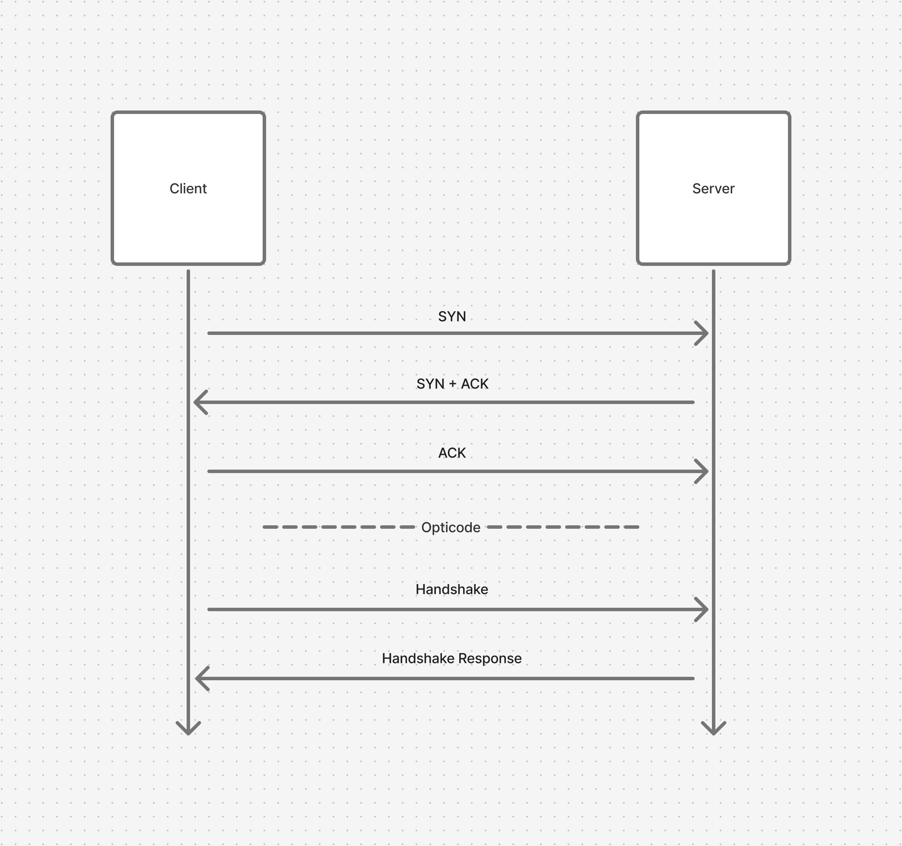

# Communication
The Opticode app listens for TCP connections from SDK clients.
On startup, the app attempts to bind to port `27430`.

## Verification
Once connected, the SDK sends a `Verification` packet.

The verification payload is structured as follows:
```go
[uint16 protocol_version]
[string language] = [varint length][utf8 bytes]
```

- **`protocol_version`**: The protocol version supported by the client.
- **`language`**: The language to be used for code generation requested by the client.

If the app supports both the requested protocol version and language, it must send a `VerificationResponse` packet indicating acceptance and the session may continue.

If the verification is rejected, the app should send a `VerificationResponse` packet containing the rejection reason before closing the connection.



## Packet Format
All communication uses a length-prefixed packet format over TCP.

All fixed-width integers are encoded using big-endian byte order.
Strings are encoded as a VarInt length followed by UTF-8 bytes.

Each packet is structured as follows:
```go
[uint32 length]
[varint packet_id]
[payload]
```

- **`length`**: Total number of bytes that follow the length field. This includes the `packet_id` and `payload`.
- **`packet_id`**: An unsigned VarInt identifying the packet type.
- **`payload`**: Packet-specific data encoded according to the `packet_id`. Its size is the remaining bytes in the packet after the `packet_id`.

The receiver should:
1. Read the 4-byte length field.
2. Read exactly `length` bytes from the stream.
3. Decode the `packet_id` from the start of that buffer.
4. Interpret the remaining bytes as the payload for that packet type.

## Packet IDs
- `0x00`: Verification
- `0x01`: VerificationResponse